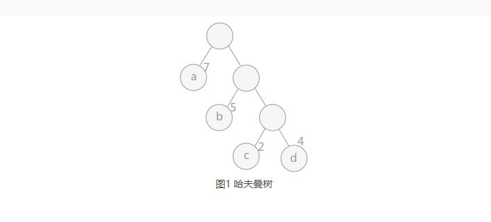
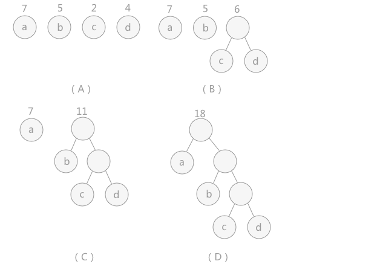

### 
- 树是由一个根结点和若干个子树构成  
- 树的结点  
    根结点【双亲结点】，子结点，兄弟结点，没有子结点的为叶子结点或叫终端结点
- 结点的度和层次
    结点的子结点个数称为结点的度，层次就是每个结点所在的层  
    
- 子树和空树  
    树中每个结点都称为子树  
    
- 有序树和无序树  
    每个结点的子结点，从左边开始为第一个孩子结点，最右边为最后一个孩子结点  
    
- 森林  
    由若干个互不相交的树组成的集合    
   
- 二叉树  
    每个结点的度数最多是2，可以是0，1  
    满二叉树，每个度数都为2
    完全二叉树 
    非完全二叉树  
    
- 二叉树的遍历  
    前序，中序，后序，层序  
    
- 树的表示法  
    双亲表示法，孩子表示法【线性表】，孩子兄弟表示法【可转换为二叉树】  
    
- 森林转换为二叉树  
    按孩子兄弟表示法转换  
    
- 哈夫曼树  
    路径：根结点到另一个结点的通路  
    结点的权：结点上的数值  
    结点长度：根结点到某一结点所经过的结点【跟结点层次有关系】  
    结点带权路径长度：结点长度*结点的权的乘积  
    
    树的带权路径长度为：树中各叶子结点的带权路径长度之和，记作WPL    
    
    当N个结点（都是叶子结点且有各自的权值）试图构建一个树时，树的带权路径长度最小，就称为最优二叉树  
    或叫哈夫曼树，或是赫夫曼树    
    
    权重越大的结点离根结点越近！！！   权重越小的就做为叶子结点  
    
    哈夫曼树的构建过程  
    1、从N个结点【权值】中选择2个最小的权重结点，构成一棵二叉树，根结点权值为左右结点权重之和  
    以此类推  
    2、再拿权值最小的结点和新组建的二叉树【根结点】进行组合   
    3、重复以上2步全部构建完成即可   
    
      
    
    哈夫曼树的构建过程   
       