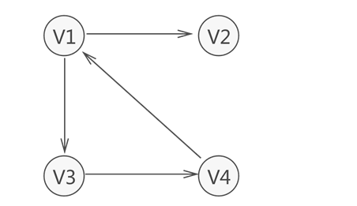

### 图  

图存储结构中的每个点称为顶点Vi,所有顶点集合称为V={V1,V2,V3,V4}  

图：有向图，无向图  

  

图存储结构的相关概念    
边    
弧：带有箭头的线    
弧头：箭头  
弧尾：箭尾  
入度：箭头方向
出度：

集合：顶点集合无向图  V={(),()}
     有向图    V = {<V1,V2>}  
     
路径，回路，环【无向图】  

路权和网：  
    边或弧的数字值称为权，带权的图称为网   
    
图存储结构分类  
    完全图，连通图，稠密图，稀疏图  
    无向完全图边数为：n(n-1)/2 
    有向完全图弧数量为：n(n-1)    
     
     
     
连通图：        
    图中任意顶点之间能够连通   
    无向图连通分量图：图中存在子图  
    子图：图中部分顶点和边构成该图的子图   
    有向图构成的强连通图   
    强连通分量图     
    
生成树和生成森林  
    对连通图遍历所经过的顶点和边称为生成树，对连通分量图的子图遍历生成树构成生成森林   
    
    